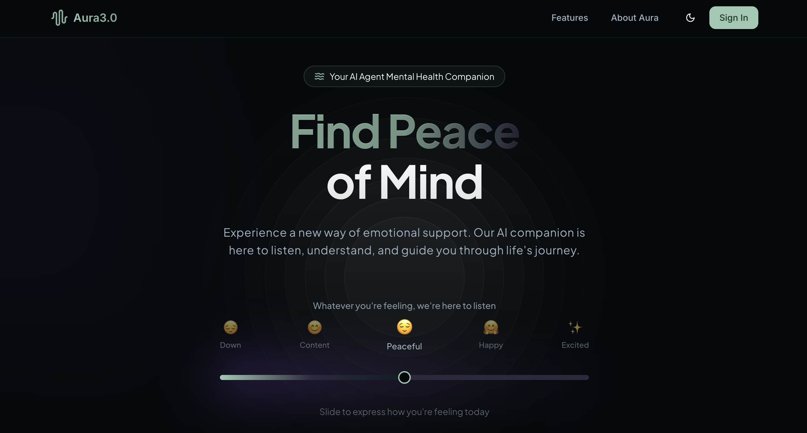
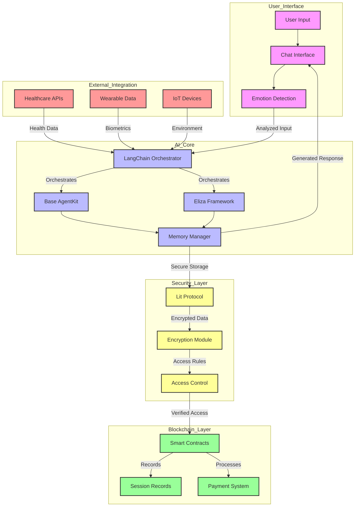

# Aura3.0 🤖💚

[](https://opensource.org/licenses/MIT)
[](https://www.hhs.gov/hipaa/index.html)
[](https://www.typescriptlang.org/)
[](https://nodejs.org/)

> A revolutionary mental health platform that combines autonomous AI agents, blockchain technology, and decentralized infrastructure to provide accessible, secure, and personalized therapeutic support.

<p align="center">
  
</p>

---

## 📄 Table of Contents

- [Overview](#overview)
- [Key Features](#key-features)
- [Technical Stack](#technical-stack)
- [Smart Contracts](#smart-contracts)
- [Getting Started](#getting-started)
- [Architecture](#architecture)
- [Security Measures](#security-measures)
- [API Documentation](#api-documentation)
- [Contributing](#contributing)
- [Deployment](#deployment)
- [License](#license)
- [Support](#support)
- [Acknowledgments](#acknowledgments)

## 🌟 Detailed Overview

Aura3.0 is a groundbreaking mental health support platform that leverages cutting-edge technologies to democratize access to quality mental healthcare. Here's what makes it special:

### Core Technology Stack

- **AI Agents**: Powered by advanced language models and autonomous agent frameworks (Base's AgentKit, Eliza)
- **Blockchain Security**: Built on Base (Ethereum L2) for secure, transparent session management
- **Decentralized Infrastructure**: Utilizing Lit Protocol for secure key management and The Graph for data indexing

### Key Innovations

1. **Autonomous Therapeutic Support**

   - 24/7 availability through AI agents
   - Real-time emotion analysis and response
   - Crisis detection and emergency protocols
   - Personalized therapeutic approaches

2. **Blockchain-Powered Trust & Security**

   - Smart contract-based consent management
   - Immutable session records
   - Transparent payment processing
   - HIPAA-compliant data handling

3. **Smart Environment Integration**

   - IoT device synchronization
   - Wearable health data integration
   - Ambient therapy environment control
   - Real-time biometric monitoring

4. **Privacy & Security**
   - End-to-end encryption
   - Zero-knowledge proofs
   - Decentralized data storage
   - Multi-factor authentication

### Use Cases & Applications

1. **Individual Therapy**

   - On-demand emotional support
   - Guided self-help sessions
   - Progress tracking and insights
   - Crisis intervention

2. **Healthcare Integration**

   - Provider collaboration
   - Health record integration
   - Prescription management
   - Treatment plan coordination

3. **Research & Analytics**
   - Anonymous data aggregation
   - Treatment efficacy analysis
   - Pattern recognition
   - Outcome tracking

### Technical Implementation

1. **Frontend Architecture**

   - Next.js 14 for server-side rendering
   - React 18 with TypeScript
   - Modern UI with shadcn/ui
   - Real-time WebSocket communication

2. **Backend Systems**

   - Node.js microservices
   - PostgreSQL with Drizzle ORM
   - WebSocket for real-time updates
   - Hardhat for smart contract deployment

3. **AI & Machine Learning**

   - LangChain for agent orchestration
   - Custom NLP models
   - Emotion detection algorithms
   - Crisis prediction systems

4. **Blockchain Infrastructure**
   - Base (Ethereum L2) smart contracts
   - Lit Protocol for key management
   - The Graph for data indexing
   - Cross-chain compatibility

### Compliance & Standards

1. **Healthcare Compliance**

   - HIPAA certification
   - SOC 2 Type II compliance
   - ISO 27001 standards
   - GDPR requirements

2. **Security Protocols**
   - Zero-trust architecture
   - Regular security audits
   - Penetration testing
   - Incident response planning

### Impact & Benefits

1. **For Users**

   - 24/7 mental health support
   - Affordable therapy options
   - Privacy protection
   - Personalized care

2. **For Healthcare Providers**

   - Extended patient reach
   - Automated documentation
   - Treatment monitoring
   - Efficient resource allocation

3. **For the Healthcare System**
   - Reduced barriers to access
   - Cost-effective delivery
   - Better outcome tracking
   - Data-driven improvements

### Future Roadmap

1. **Q2 2025**

   - Multi-language support
   - Advanced AI model integration
   - Mobile app release
   - Healthcare provider portal

2. **Q3 2025**

   - Insurance integration
   - Group therapy features
   - Advanced analytics dashboard
   - Research collaboration platform

3. **Q4 2025**
   - Global expansion
   - Additional blockchain integrations
   - Enhanced IoT capabilities
   - AI model customization

## ✨ Key Features

### 🤖 Autonomous AI Therapy

- Intelligent AI agents providing empathetic mental health support
- Natural language processing for understanding user emotions
- Personalized therapy approaches based on user needs
- Crisis detection and emergency response protocols

### 🔐 Blockchain-Powered Trust

- Smart contract-based therapy session management
- Transparent consent and data handling
- Decentralized storage of therapy records
- Secure payment processing with cryptocurrency options

### 🎯 Smart Environment Integration

- IoT device integration for ambient therapy
- Wearable data integration for health monitoring
- Automated environment adjustments based on user state
- Real-time stress level monitoring

### 📊 Progress Tracking

- Detailed analytics on mental health progress
- Blockchain-verified session records
- Integration with healthcare providers
- Automated follow-up scheduling

## 🛠 Technical Stack

### Frontend

```typescript
// Modern React stack with strong typing
import { NextJS, React, TailwindCSS, ThreeJS } from "frontend-stack";
```

- Next.js 14 for server-side rendering
- React 18 with TypeScript
- TailwindCSS for styling
- shadcn/ui components

### Backend

```typescript
// Scalable backend architecture
import { NodeJS, TypeScript, PostgreSQL } from "backend-stack";
```

- Node.js with TypeScript
- Hardhat for smart contract development
- Drizzle ORM with PostgreSQL
- WebSocket for real-time communication

### AI/ML

- LangChain for AI agent orchestration
- OpenAI integration
- Custom NLP models for emotion detection
- Agent frameworks (Base's AgentKit, Eliza)

### Blockchain

```solidity
// Multi-chain support
contract TherapyPlatform {
    // Ethereum + Base integration
}
```

- Ethereum smart contracts (Solidity)
- Flow blockchain integration
- Lit Protocol for secure key management
- The Graph for data indexing

## 🔒 Security & Compliance

### Security Features

- HIPAA compliant infrastructure
- End-to-end encryption
- Zero-knowledge proofs
- Multi-factor authentication
- Regular security audits

### Certifications

- HIPAA Compliance
- SOC 2 Type II
- ISO 27001
- GDPR Compliance

## 📝 Smart Contracts

### TherapyConsent.sol

```solidity
contract TherapyConsent {
    // Core therapy session management
}
```

- Manages therapy session consent
- Handles session recording permissions
- Controls data access rights
- Implements HIPAA compliance measures

## 🚀 Getting Started

### System Requirements

- Node.js 18+
- PostgreSQL 14+
- Hardhat
- MetaMask or compatible Web3 wallet

### Quick Start

```bash
# Clone repository
git clone https://github.com/blocklinklabs/aura3.0.git
cd aura3.0

# Install dependencies
npm install

# Setup environment
cp .env.example .env.local

# Start development server
npm run dev

# Deploy contracts
npx hardhat run scripts/deploy.js --network baseSepolia
```

## 🏗 Architecture

### AI Agent System Architecture



### Architecture Components Explanation

1. **User Interface Layer**

   - User Input: Text, voice, or biometric data
   - Chat Interface: Real-time communication portal
   - Emotion Detection: NLP-based sentiment analysis

2. **AI Core Layer**

   - LangChain Orchestrator: Manages AI agent interactions
   - Base AgentKit: Primary agent framework
   - Eliza Framework: Therapeutic conversation model
   - Memory Manager: Maintains context and history

3. **Security Layer**

   - Lit Protocol: Decentralized key management
   - Encryption Module: End-to-end data protection
   - Access Control: Permission management

4. **Blockchain Layer**

   - Smart Contracts: Session and consent management
   - Session Records: Immutable therapy records
   - Payment System: Crypto payment processing

5. **External Integration Layer**
   - Healthcare APIs: Provider system integration
   - Wearable Data: Health metrics collection
   - IoT Devices: Environmental control

### Data Flow Process

1. **Input Processing**

   - User provides input through interface
   - Emotion detection analyzes sentiment
   - Input is encrypted and validated

2. **AI Processing**

   - LangChain orchestrates agent responses
   - AgentKit and Eliza process therapy logic
   - Memory system maintains context

3. **Security Handling**

   - All data is encrypted via Lit Protocol
   - Access control verifies permissions
   - Blockchain records interactions

4. **Response Generation**

   - AI generates appropriate response
   - Response is verified for safety
   - Delivered back to user interface

5. **External Data Integration**
   - Health data is continuously monitored
   - Environment is adjusted as needed
   - Records are securely maintained

## 🔐 Security Measures

### Authentication & Authorization

- Zero-trust authentication model
- Role-based access control
- JWT with refresh tokens
- Biometric authentication support

### Data Protection

- End-to-end encryption
- At-rest encryption
- Secure key management
- Regular security audits

## 👥 Contributing

We welcome contributions! Please see our [Contributing Guidelines](CONTRIBUTING.md) for details.

### Development Guidelines

- Follow TypeScript best practices
- Write comprehensive tests
- Document all API endpoints
- Maintain HIPAA compliance
- Use conventional commits

### Code Quality

```bash
# Run tests
npm test

# Check code style
npm run lint

# Build project
npm run build
```

## 📦 Deployment

### Production Deployment

```bash
# Build for production
npm run build

# Start production server
npm start
```

## 📄 License

This project is licensed under the MIT License - see the [LICENSE](LICENSE) file for details.

## 🙏 Acknowledgments

### Partners & Supporters

- Autonome ✅
- Nethermind ✅
- Base ✅
- Coinbase Developer platform ✅
- All our contributors and supporters

---

<p align="center">
  <br>
  Built with ❤️ for better mental health through technology
  <br>
  Copyright © 2025 AI Agent Therapist
</p>
