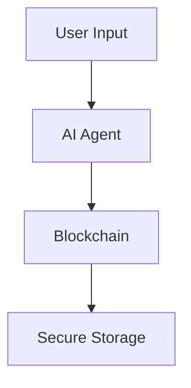

# AI Agent Therapist 🤖💚

[](https://opensource.org/licenses/MIT)
[](https://www.hhs.gov/hipaa/index.html)
[](https://www.typescriptlang.org/)
[](https://nodejs.org/)

> A next-generation mental health platform powered by autonomous AI agents, blockchain technology, and decentralized infrastructure.

<p align="center">
  
</p>

---

## 📋 Table of Contents

- [Overview](#overview)
- [Key Features](#key-features)
- [Technical Stack](#technical-stack)
- [Smart Contracts](#smart-contracts)
- [Getting Started](#getting-started)
- [Architecture](#architecture)
- [Security Measures](#security-measures)
- [API Documentation](#api-documentation)
- [Contributing](#contributing)
- [Deployment](#deployment)
- [License](#license)
- [Support](#support)
- [Acknowledgments](#acknowledgments)

## 🌟 Overview

AI Agent Therapist is a revolutionary mental health support platform that combines cutting-edge AI technology with blockchain-based trust and security mechanisms. The platform provides 24/7 mental health support through intelligent AI agents while ensuring user privacy, data security, and transparent therapy session management.

### 🎯 Vision

To democratize access to mental health support through ethical AI and blockchain technology, making quality therapeutic care available to everyone, everywhere, at any time.

### 🌍 Impact

- 24/7 mental health support accessibility
- Reduced barriers to mental healthcare
- Privacy-first approach to therapy
- Transparent and accountable AI systems

## ✨ Key Features

### 🤖 Autonomous AI Therapy

- Intelligent AI agents providing empathetic mental health support
- Natural language processing for understanding user emotions
- Personalized therapy approaches based on user needs
- Crisis detection and emergency response protocols

### 🔐 Blockchain-Powered Trust

- Smart contract-based therapy session management
- Transparent consent and data handling
- Decentralized storage of therapy records
- Secure payment processing with cryptocurrency options

### 🎯 Smart Environment Integration

- IoT device integration for ambient therapy
- Wearable data integration for health monitoring
- Automated environment adjustments based on user state
- Real-time stress level monitoring

### 📊 Progress Tracking

- Detailed analytics on mental health progress
- Blockchain-verified session records
- Integration with healthcare providers
- Automated follow-up scheduling

## 🛠 Technical Stack

### Frontend

```typescript
// Modern React stack with strong typing
import { NextJS, React, TailwindCSS, ThreeJS } from "frontend-stack";
```

- Next.js 14 for server-side rendering
- React 18 with TypeScript
- TailwindCSS for styling
- shadcn/ui components

### Backend

```typescript
// Scalable backend architecture
import { NodeJS, TypeScript, PostgreSQL } from "backend-stack";
```

- Node.js with TypeScript
- Hardhat for smart contract development
- Drizzle ORM with PostgreSQL
- WebSocket for real-time communication

### AI/ML

- LangChain for AI agent orchestration
- OpenAI integration
- Custom NLP models for emotion detection
- Agent frameworks (Base's AgentKit, Eliza)

### Blockchain

```solidity
// Multi-chain support
contract TherapyPlatform {
    // Ethereum + Base integration
}
```

- Ethereum smart contracts (Solidity)
- Flow blockchain integration
- Lit Protocol for secure key management
- The Graph for data indexing

## 🔒 Security & Compliance

### Security Features

- HIPAA compliant infrastructure
- End-to-end encryption
- Zero-knowledge proofs
- Multi-factor authentication
- Regular security audits

### Certifications

- HIPAA Compliance
- SOC 2 Type II
- ISO 27001
- GDPR Compliance

## 📝 Smart Contracts

### TherapyConsent.sol

```solidity
contract TherapyConsent {
    // Core therapy session management
}
```

- Manages therapy session consent
- Handles session recording permissions
- Controls data access rights
- Implements HIPAA compliance measures

## 🚀 Getting Started

### System Requirements

- Node.js 18+
- PostgreSQL 14+
- Hardhat
- MetaMask or compatible Web3 wallet

### Quick Start

```bash
# Clone repository
git clone https://github.com/blocklinklabs/aura3.0.git
cd aura3.0

# Install dependencies
npm install

# Setup environment
cp .env.example .env.local

# Start development server
npm run dev

# Deploy contracts
npx hardhat run scripts/deploy.js --network baseSepolia
```

### Environment Configuration

```bash
# Required environment variables
NEXT_PUBLIC_WALLET_CONNECT_PROJECT_ID=your_project_id
NEXT_PUBLIC_ALCHEMY_API_KEY=your_alchemy_key
DATABASE_URL=your_database_url
```

## 🏗 Architecture

### Agent System



- Autonomous AI agents for therapy sessions
- Multi-agent coordination
- Secure communication
- Dynamic behavior adaptation

### Data Flow

1. User interaction via frontend
2. AI agent processing with LangChain
3. Blockchain verification and recording
4. Secure data storage with encryption
5. Real-time analytics and monitoring

## 🔐 Security Measures

### Authentication & Authorization

- Zero-trust authentication model
- Role-based access control
- JWT with refresh tokens
- Biometric authentication support

### Data Protection

- End-to-end encryption
- At-rest encryption
- Secure key management
- Regular security audits

## 👥 Contributing

We welcome contributions! Please see our [Contributing Guidelines](CONTRIBUTING.md) for details.

### Development Guidelines

- Follow TypeScript best practices
- Write comprehensive tests
- Document all API endpoints
- Maintain HIPAA compliance
- Use conventional commits

### Code Quality

```bash
# Run tests
npm test

# Check code style
npm run lint

# Build project
npm run build
```

## 📦 Deployment

### Production Deployment

```bash
# Build for production
npm run build

# Start production server
npm start
```

## 📄 License

This project is licensed under the MIT License - see the [LICENSE](LICENSE) file for details.

## 🙏 Acknowledgments

### Partners & Supporters

- Autonome ✅
- Nethermind ✅
- Base ✅
- Coinbase Developer platform ✅
- All our contributors and supporters

---

<p align="center">
  <br>
  Built with ❤️ for better mental health through technology
  <br>
  Copyright © 2025 AI Agent Therapist
</p>
